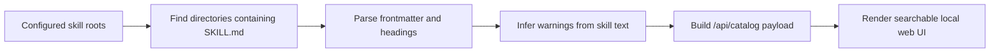

# Skill Registry

[中文说明](./README.zh-CN.md)

A local web catalog for browsing, auditing, and managing installed Codex and agent skills on your own machine.

Skill Registry scans one or more skill roots, reads `SKILL.md` files, and renders a searchable UI with:

- skill names
- descriptions and `Use when ...` hints
- source roots
- duplicate names
- heuristic risk labels such as `gh issue create`, `git push`, `git worktree`, dependency install, and subagent usage

## Features

- Local-first catalog that reflects the skills installed on the current machine
- Multiple root support for `~/.codex/skills`, `~/.agents/skills`, or custom paths
- Searchable skill inventory with short-token matching for queries like `ui`, `qa`, and `pr`
- Heuristic risk labels inferred from `SKILL.md`
- Duplicate name detection across different roots
- Path masking by default so the UI shows `~/...` instead of full absolute paths
- English / Chinese UI toggle, with English as the default
- Zero-build setup: just run `python3 server.py`
- Optional Docker Compose setup for repeatable local deployment

## How It Works



## What It Is

This project is designed to be cloned and run locally on your own machine.

It does **not** bundle your skill inventory. Instead, it inspects the skill directories on the machine where it is running.

## Default Scan Paths

By default it scans:

- `~/.codex/skills`
- `~/.agents/skills`

If a directory contains a `SKILL.md`, it is treated as a skill entry.

## Quick Start

```bash
git clone <your-repo-url> skill-registry
cd skill-registry
python3 server.py
```

Then open:

```text
http://127.0.0.1:4455
```

## Docker

You can also run it with Docker Compose:

```bash
docker compose up --build
```

This mounts your local skill directories read-only into the container:

- `${HOME}/.codex/skills`
- `${HOME}/.agents/skills`

Then open:

```text
http://127.0.0.1:4455
```

## Configuration

Environment variables:

- `HOST`
  Default: `0.0.0.0`
- `PORT`
  Default: `4455`
- `CATALOG_REFRESH_MS`
  Default: `60000`
- `SHOW_ABSOLUTE_PATHS`
  Default: disabled  
  Set to `true` to show full absolute filesystem paths instead of `~`-masked paths.
- `CODEX_SKILLS_ROOT`
  Override the default `~/.codex/skills`
- `AGENTS_SKILLS_ROOT`
  Override the default `~/.agents/skills`
- `SKILL_ROOTS`
  Optional path list override. If set, it replaces the two defaults entirely.
  Use your platform path separator:
  - macOS/Linux: `:`
  - Windows: `;`

Example:

```bash
HOST=127.0.0.1 PORT=4455 CATALOG_REFRESH_MS=5000 python3 server.py
```

You can also copy the example env file first:

```bash
cp .env.example .env
```

Example with custom roots:

```bash
SKILL_ROOTS="$HOME/.codex/skills:$HOME/.agents/skills:/some/extra/skills" python3 server.py
```

## Project Structure

```text
skill-registry/
├── server.py                  # local HTTP server + catalog API
├── web/
│   ├── index.html             # UI shell
│   ├── app.js                 # client-side rendering + search logic
│   └── styles.css             # page styling
├── Dockerfile
├── docker-compose.yml
├── .env.example
├── README.md
└── README.zh-CN.md
```

## Privacy

By default, displayed paths are masked to `~/...`.

This project is intended for local/self-hosted use. If you expose it on a network, remember that the catalog reflects the installed skills on the host machine.

## Development Checks

Local checks:

```bash
python3 -m py_compile server.py
node --check web/app.js
```

## Notes

- Risk labels are heuristic. They are inferred by scanning `SKILL.md` text.
- Search supports short-token prefix matching for short queries like `ui`, `qa`, `pr`.
- The UI auto-refreshes from `/api/catalog` on a timer.
- If you publish this repository, anyone who clones and runs it will inspect the skills installed on their own machine; the app does not bundle your skill inventory.

## License

MIT
